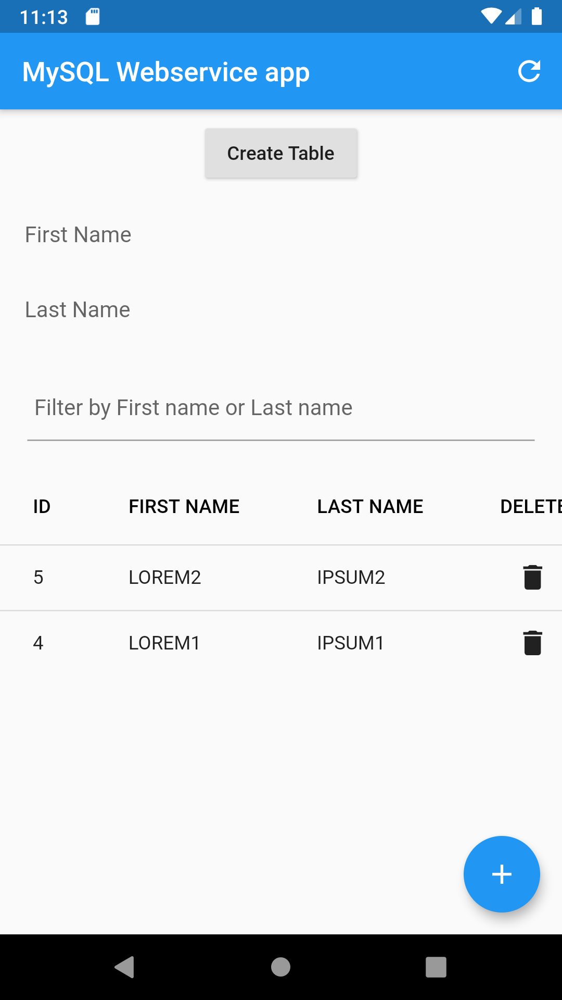
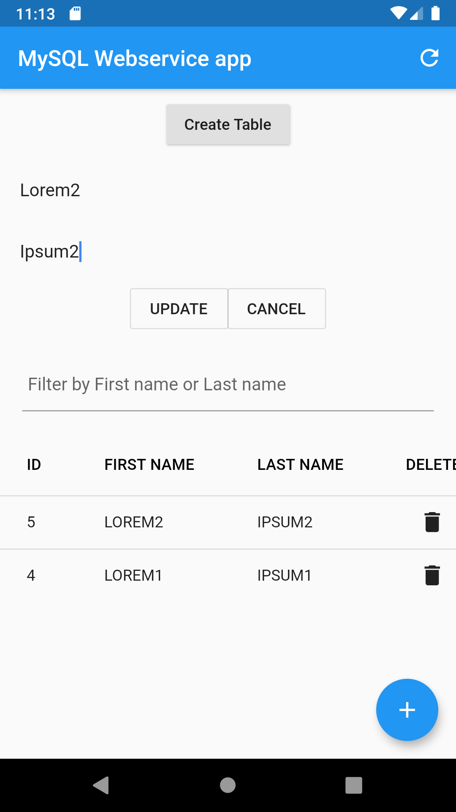

# webservice_mysql_app

This is a learning application. This app (Flutter Application) access a MYSQL Web Service  and do CRUD operations on the online database with the help of a php script. This app also implements a Debouncing technique.

This app can:
- Create a table
- Filter Records with a search bar
- Insert, Delete and Update records
- Fetch all records

## Screenshots
Home Page                  |  Updating a record
:-------------------------:|:-------------------------:
||